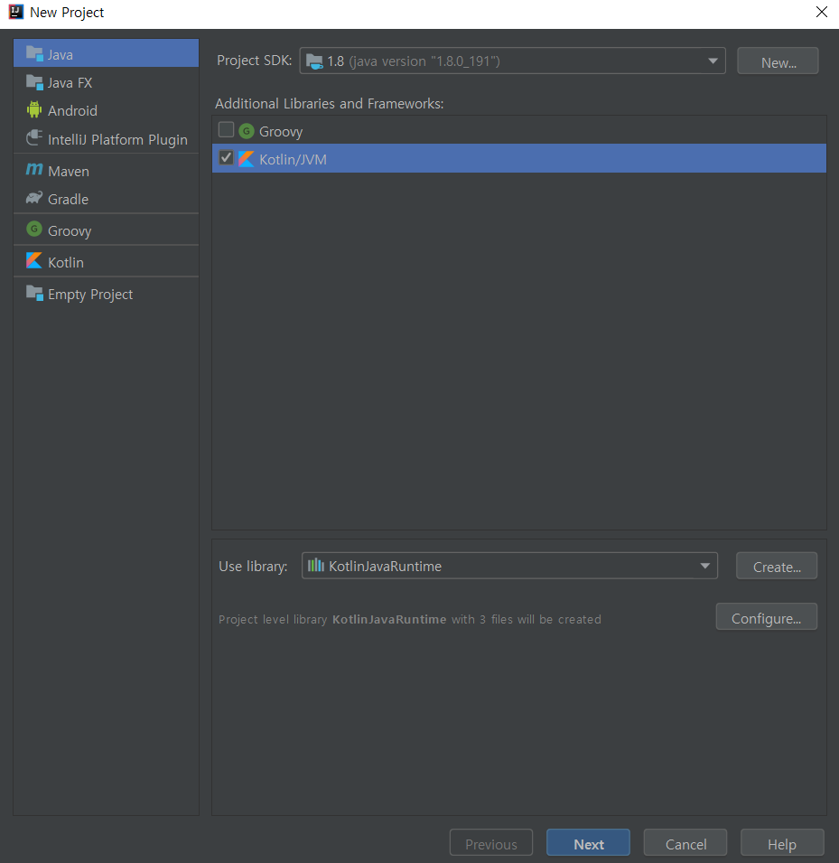
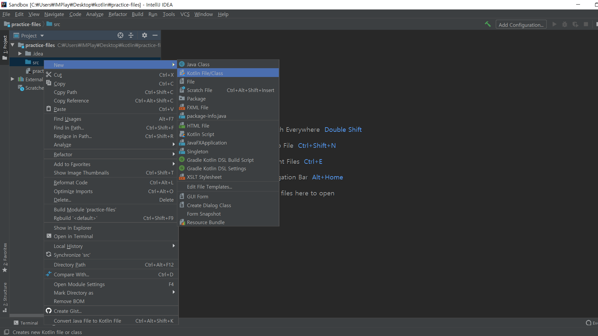
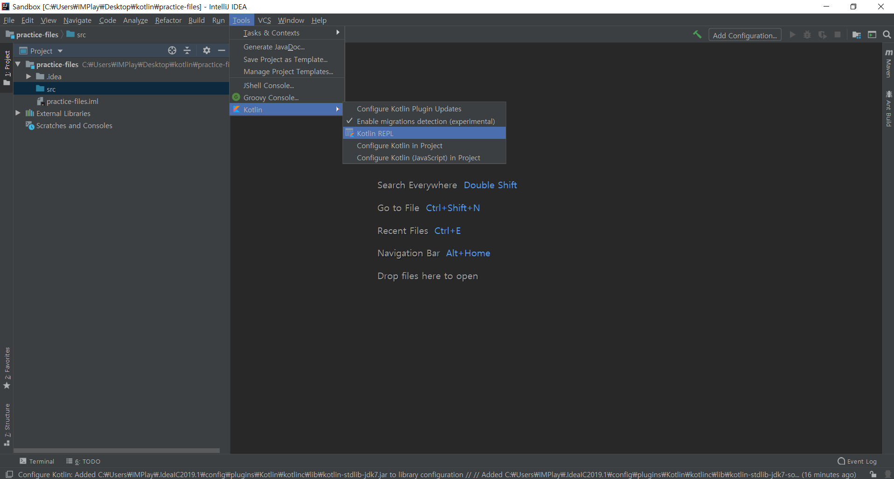
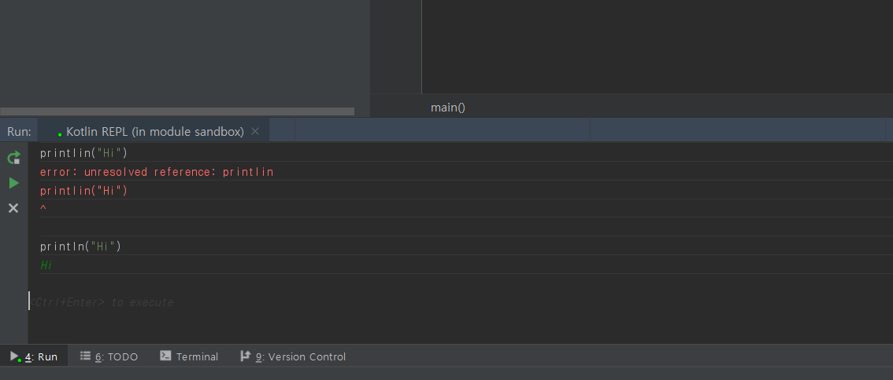

# 인텔리제이의 모든 것 (1)

### 인텔리제이에서 Kotlin 프로젝트 시작하기

1. 인텔리제이 웰컴 대화상자에서 'create new project' 클릭

2. 프로젝트 생성 대화상자에서 'Kotlin/JVM' 선택하고 Next를 누른다.

   이를 통해 kotlinc-jvm 컴파일러를 사용해서 <u>코틀린 코드</u>를 JVM(Java Virtual Machine)에서 실행할 수 있는 바이트코드로 변환할 수 있다. JVM은 변환된 <u>바이트 코드</u>를 콘솔에 출력한다. 우리는 이 과정을 <strong>컴파일</strong>이라고 부른다.

3. 프로젝트 이름을 적고 프로젝트를 저장하고자 하는 디렉토리를 지정하고 finish를 누른다.

4. src를 클릭하고 마우스 오른쪽 버튼을 눌러 new → Kotlin File/Class를 선택한다.

   

---------------------

### 인텔리제이 테스팅: 코틀린 REPL(Read Evalute Print Loop)

파일을 생성하지 않고 코드를 빨리 테스트하는 도구

<b>Tools → Kotlin → Kotlin REPL</b>

<strong> 실행하고자 하는 코드를 작성  →  ctrl + enter</strong>

