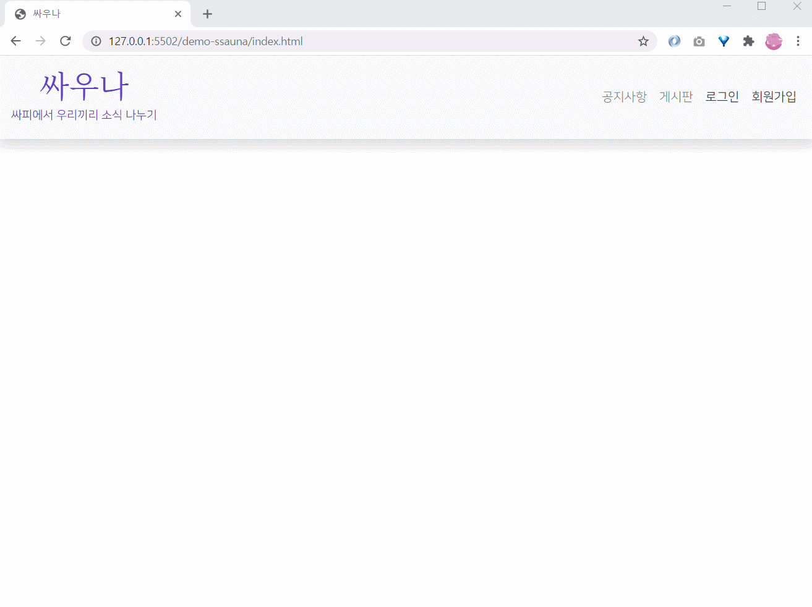

# 🌟 싸우나 SSAUNA

### 싸피에서 우리끼리 소식 나누기👨‍👩‍👦‍👦

#### 🌃 배경

- 싸피에서 현재 배우고 있는 jquery와 bootstrap을 숙련시키기 위해!
- 게시판만들거면 조금 더 의미부여하고 싶어서!

#### 🎈 단계별 구현

0. 폴더 구조화 및 헤더

   - [x] js, html, css 폴더 나누기
   - [ ] 헤더(네비게이션) 반응형

1. 로그인 및 회원가입
   - [ ] 로그인 모달 위치 조절 (화면 중앙으로)
   
   - [ ] 회원가입 유효성 체크
     - [x] 이메일 형식
     - [x] 비밀번호, 이름, 휴대폰번호 길이
     - [ ] 휴대폰번호 형식
   - [x] 다음api를 이용한 회원가입 주소 검색
   
   - [ ] 회원등록

#### 단계별 화면 💨
