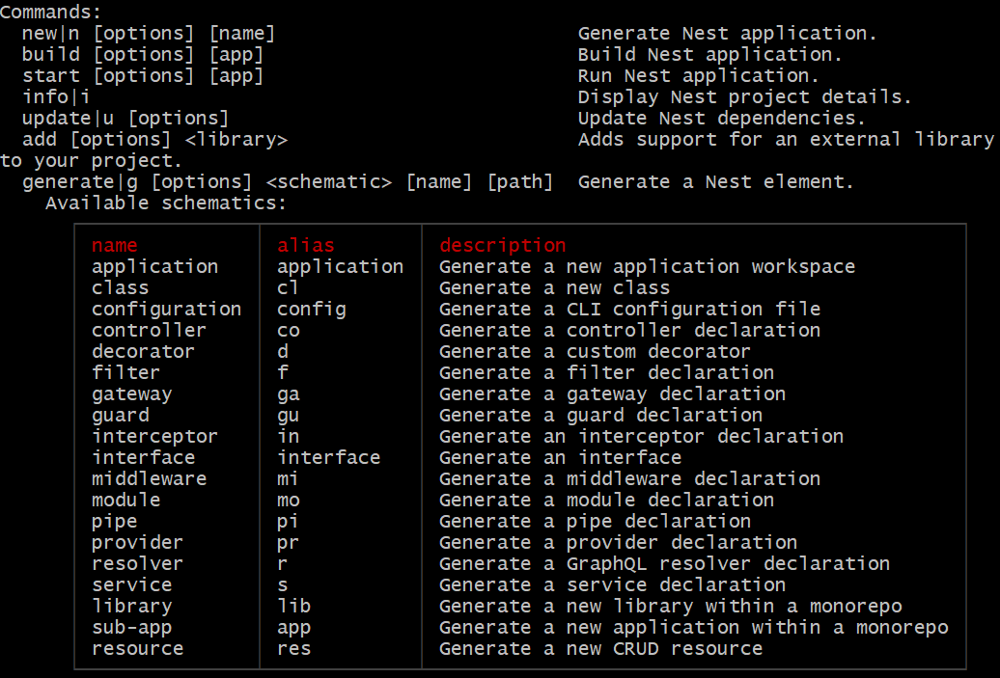
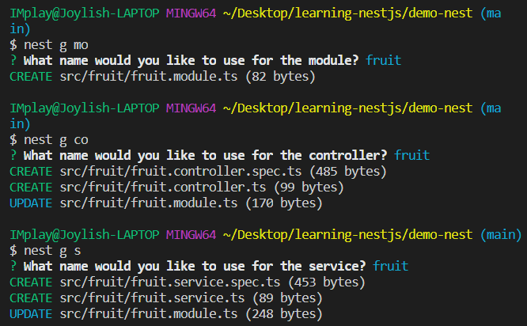
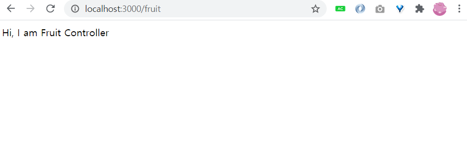

# 2020-12-24 TIL

## 🐾 진행상황
 - NestJS로 API 만들기 - 7/24(약 20%)

## 🍜 공부하면서 느낀 점 및 후기

## 🍧 기억하고 싶거나 어려웠던 개념 정리

### 1. 모델 생성

터미널에 `nest`을 입력하면 command 관련 name, alias, description을 볼 수 있다.

<p align="center">

</p>

fruit 도메인에 대한 모델을 생성해보았다.

```bash
nest g mo fruit
nest g co fruit
nest g s fruit
```
<p align="center">

</p>

fruit.controller.ts에 `@Get()`을 추가해보았다.

```javascript
@Get()
  getFruit() {
    return "Hi, I am Fruit Controller";
  }
```

`localhost:3000/fruit`을 하면 `getFruit()`가 실행된다. 그 이유는 `@Controller()`의 인자로 "fruit"가 들어갔기 때문에 path인자가 추가된다.

<p align="center">

</p>

